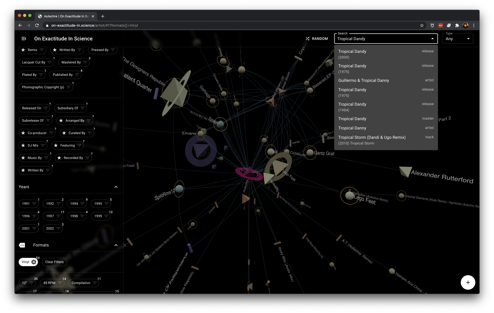

# on-exactitude-in-science
Map of the World



## Quickstart

Fetch the Discogs dataset:

```
make fetch-dataset
```

Pull and build Docker images:

```
docker-compose pull
docker-compose build
```

Bring JanusGraph online and populate it:

```
make LIMIT=10000 load-from-scratch
```

Bring the API container online:

```
docker-compose up -d api
```

Build the GUI:

```
make build-gui
```

Bring the GUI container online:

```
docker-compose up -d gui
```

Now you can visit localhost:8080 to see.

## Debugging

```
docker exec -it $(docker-compose ps --quiet janusgraph) ./bin/gremlin.sh
```

```
gremlin> :remote connect tinkerpop.server conf/remote.yaml session
gremlin> :remote console
```
