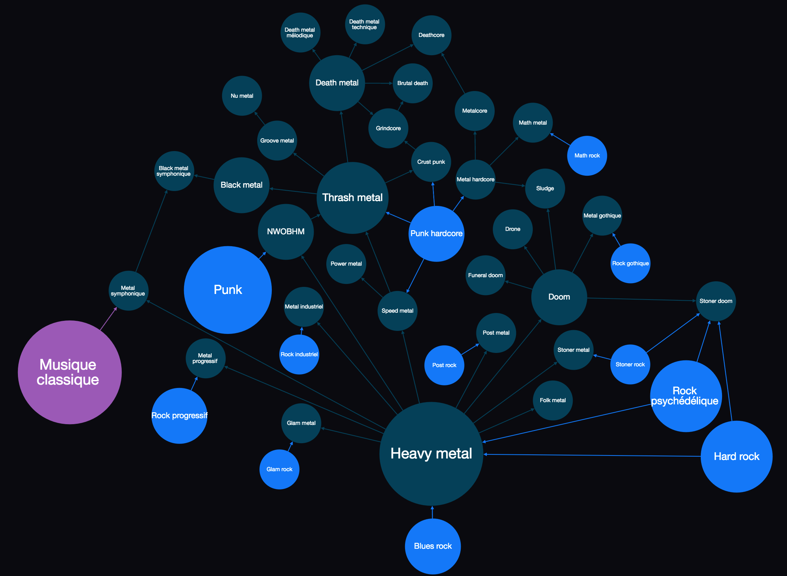
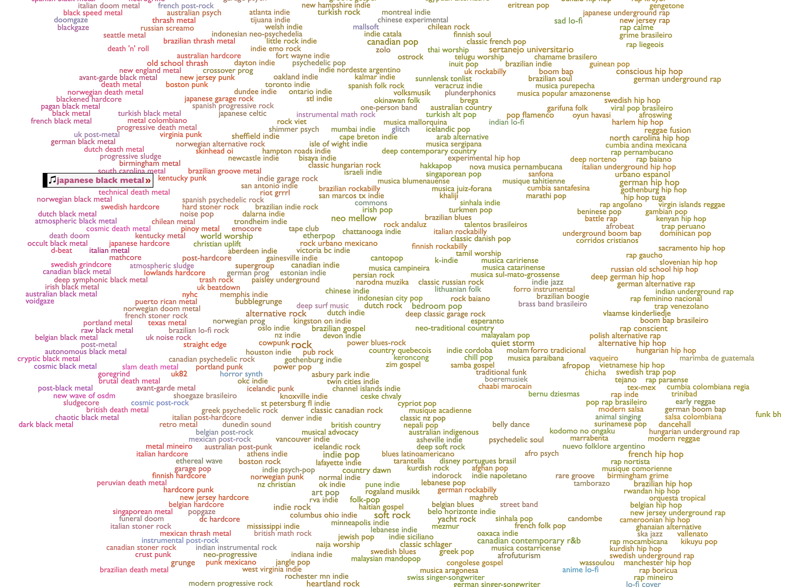
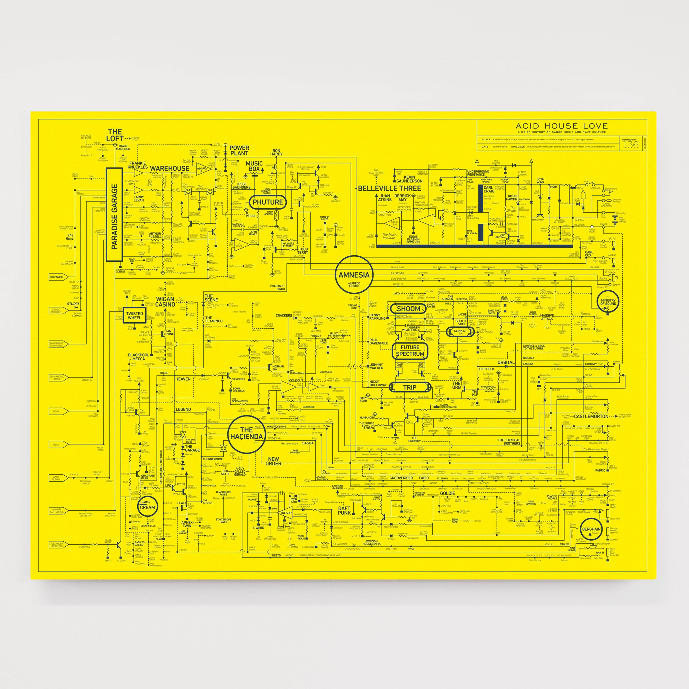
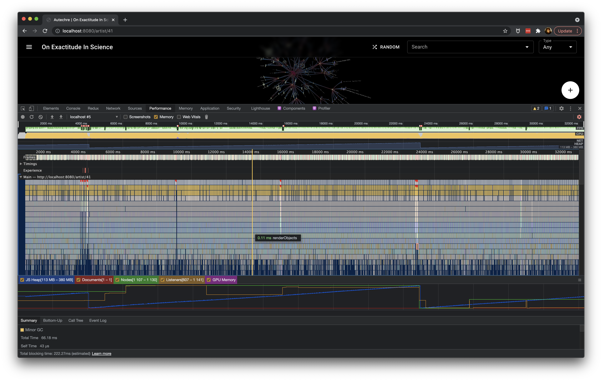
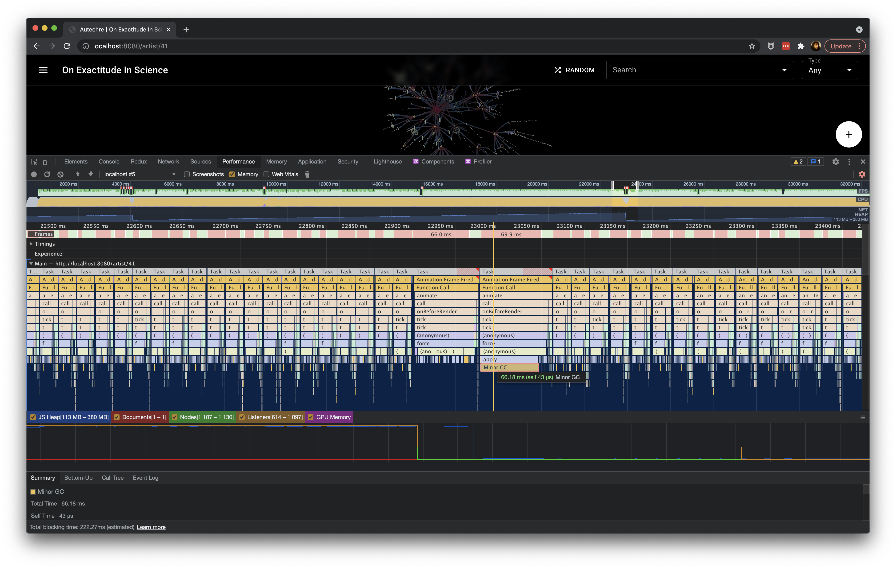
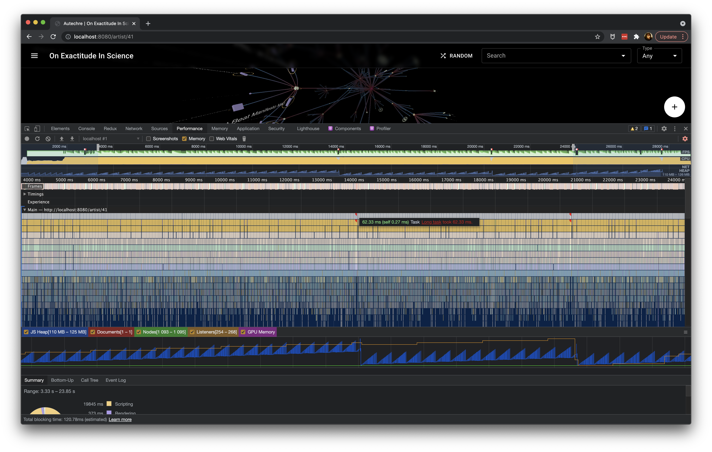
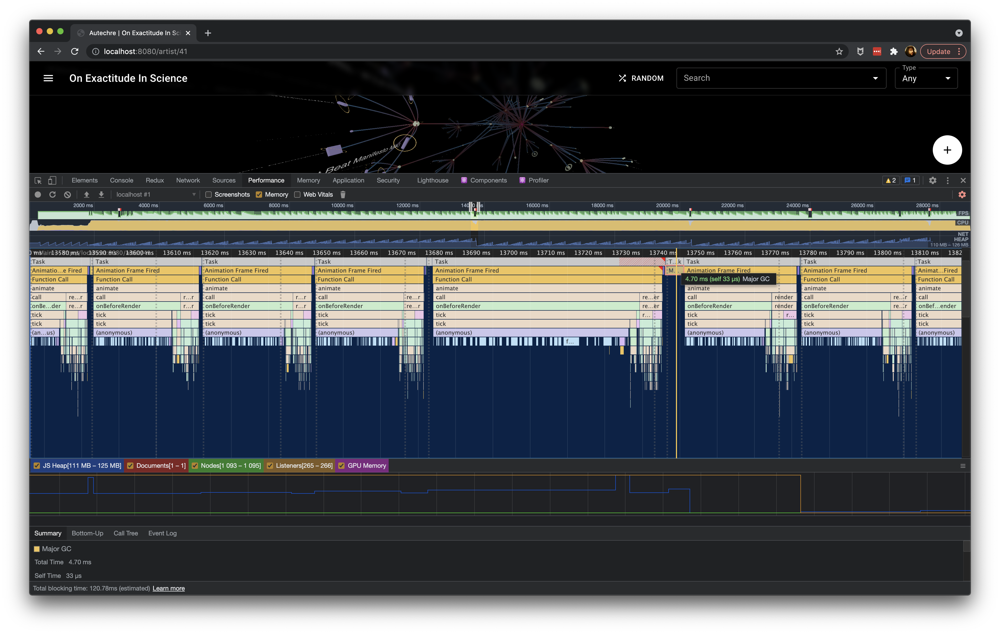

======================
Mapping Recorded Music
======================

Howdy
=====

Who I am
--------

- Make my coin as a software engineer
- My background is in the arts and music industry
- Currently in Kingston, NY

.. nextslide::

- Oberlin: BMus in composition
- Forced Exposure: music distribution
- Harvard: masters / PhD in composition
- Music21 @ MIT: toolkit for digital musicology
- Discogs: music database / marketplace
- CapitalOne: banking core modernization

A cute dog
----------

Musical maps
============

State of play
-------------

- A variety of musical maps exist today
- Some are interactive, some aren't
- Most are concerned with concepts of "genre", "style", "period" and how these
  categories mutate into other categories, and generate new categories
- *But*, they almost all represent music history as a graph

.. nextslide:: ""

.. nextslide:: ""

.. nextslide:: ""

.. nextslide:: ""

.. figure:: images/map-of-ishkur.png
   :class: fill

Lossy abstractions
------------------

- Abstract categorizations are highly subjective
- They elide really interesting information:

  - Who collaborated with who?
  - Who curated or published who, and when?
  - How do multiple labels' curation overlap to create the "moire" effect that
    we want to recognize as style?

Materialist view of history
---------------------------

- Style, and genre don't exist
- But humans and the artifacts of their production do
- Specific artists, companies, releases and songs
- Specific years, countries and formats
- What if we could map these concrete interactions?

We have the data
----------------

- https://discogs.com Discographic Dataset
- http://data.discogs.com/
- Monthly XML dumps
- CC-0 licensed
- 1.7 million companies
- 7.7 million artists
- 14.3 million releases
- 1.9 million "masters"

.. nextslide::

::

    <artist>
      <images>...</images>
      <id>8</id>
      <name>Mood II Swing</name>
      <realname>John Ciafone &amp; Lem Springsteen</realname>
      <profile>...</profile>
      <namevariations><name>...</name></namevariations>
      <aliases>
        <name id="26498">Chronic Sounds</name>
        <name id="34749">Urbanized</name>
        ...
      </aliases>
      <members>
        <id>12186</id>
        <name id="12186">John Ciafone</name>
        <id>27959</id>
        <name id="27959">Lem Springsteen</name>
      </members>
    </artist>

.. nextslide::

.. graphviz::
   :align: center

    digraph G {
        a1 [label="Mood II Swing"]
        a2 [label="Chronic Sounds"]
        a3 [label="Urbanized"]
        a4 [label="John Ciafone"]
        a5 [label="Lem Springsteen"]
        a1 -> a2 [dir=both,label="alias"]
        a1 -> a3 [dir=both,label="alias"]
        a4 -> a1 [label="member"]
        a5 -> a1 [label="member"]
    }

.. nextslide::

.. code-block:: xml
   :class: overflow

    <release id="9" status="Accepted">
      <images>
        <image type="primary" uri="" uri150="" width="592" height="600"/>
        <image type="secondary" uri="" uri150="" width="600" height="599"/>
        <image type="secondary" uri="" uri150="" width="600" height="602"/>
        <image type="secondary" uri="" uri150="" width="600" height="599"/>
      </images>
      <artists>
        <artist>
          <id>33</id>
          <name>Blue Six</name>
          <anv/>
          <join/>
          <role/>
          <tracks/>
        </artist>
      </artists>
      <title>Pure</title>
      <labels>
        <label name="Naked Music Recordings" catno="NM008" id="10"/>
      </labels>
      <extraartists>
        <artist>
          <id>74994</id>
          <name>Bruno Ybarra</name>
          <anv/>
          <join/>
          <role>Executive-Producer</role>
          <tracks/>
        </artist>
        <artist>
          <id>209463</id>
          <name>David Boonshoft</name>
          <anv>Dave Boonshoft</anv>
          <join/>
          <role>Executive-Producer</role>
          <tracks/>
        </artist>
        <artist>
          <id>99026</id>
          <name>Monique Bingham</name>
          <anv>Monique</anv>
          <join/>
          <role>Featuring, Vocals</role>
          <tracks/>
        </artist>
        <artist>
          <id>32</id>
          <name>Jay Denes</name>
          <anv>J. Denes</anv>
          <join/>
          <role>Producer, Arranged By</role>
          <tracks/>
        </artist>
        <artist>
          <id>32</id>
          <name>Jay Denes</name>
          <anv>J. Denes</anv>
          <join/>
          <role>Written-By</role>
          <tracks/>
        </artist>
        <artist>
          <id>99026</id>
          <name>Monique Bingham</name>
          <anv>M. Bingham</anv>
          <join/>
          <role>Written-By</role>
          <tracks/>
        </artist>
      </extraartists>
      <formats>
        <format name="Vinyl" qty="1" text="">
          <descriptions>
            <description>12"</description>
            <description>33 ⅓ RPM</description>
          </descriptions>
        </format>
      </formats>
      <genres>
        <genre>Electronic</genre>
      </genres>
      <styles>
        
        
      </styles>
      <country>US</country>
      <released>2000</released>
      <notes>Track A1: engineered at Moulton Street/SF.
    Track A2: original version written for Naked Music Recordings.
    C &amp; P Fur &amp; Femur Music (BMI)/M. Bingham (ASCAP) 2000.
    Naked Music NYC Recordings, LLC</notes>
      <data_quality>Correct</data_quality>
      <master_id is_main_release="true">595959</master_id>
      <tracklist>
        <track>
          <position>A1</position>
          <title>Pure (Mig's Petalpusher Vocal)</title>
          <duration>7:02</duration>
          <extraartists>
            <artist>
              <id>9571</id>
              <name>Jay-J</name>
              <anv/>
              <join/>
              <role>Engineer</role>
              <tracks/>
            </artist>
            <artist>
              <id>669</id>
              <name>Petalpusher</name>
              <anv/>
              <join/>
              <role>Remix, Arranged By</role>
              <tracks/>
            </artist>
          </extraartists>
        </track>
        <track>
          <position>A2</position>
          <title>Pure (Jay's Original Vocal)</title>
          <duration>4:30</duration>
          <extraartists>
            <artist>
              <id>209463</id>
              <name>David Boonshoft</name>
              <anv>D. Boonshoft</anv>
              <join/>
              <role>Bass</role>
              <tracks/>
            </artist>
            <artist>
              <id>352023</id>
              <name>Mark Anthony Jones</name>
              <anv>Mark Anthony 'thefunkiestmanalive' Jones</anv>
              <join/>
              <role>Guitar, Backing Vocals</role>
              <tracks/>
            </artist>
          </extraartists>
        </track>
        <track>
          <position>B1</position>
          <title>Pure (Aquanote Tidal Mix)</title>
          <duration>6:50</duration>
          <extraartists>
            <artist>
              <id>38</id>
              <name>Aquanote</name>
              <anv/>
              <join/>
              <role>Remix, Arranged By</role>
              <tracks/>
            </artist>
          </extraartists>
        </track>
        <track>
          <position>B2</position>
          <title>Pure (Jay's Undercover Dub)</title>
          <duration>6:45</duration>
          <extraartists>
            <artist>
              <id>32</id>
              <name>Jay Denes</name>
              <anv>J. Denes</anv>
              <join/>
              <role>Remix, Arranged By</role>
              <tracks/>
            </artist>
          </extraartists>
        </track>
      </tracklist>
      <identifiers>
        <identifier type="Matrix / Runout" description="Side A, hand-etched runout" value="NM-008 A1"/>
        <identifier type="Matrix / Runout" description="Side B, hand-etched runout" value="NM-008 B1"/>
        <identifier type="Rights Society" value="BMI"/>
        <identifier type="Rights Society" value="ASCAP"/>
      </identifiers>
      <videos>
        <video src="https://www.youtube.com/watch?v=rFRvw6zyo3o" duration="1525" embed="true">
          <title>Blue Six Pure Full 12</title>
          <description/>
        </video>
        <video src="https://www.youtube.com/watch?v=LMSX1uj-Kqc" duration="403" embed="true">
          <title>Blue Six - Pure (Jay's Undercover Dub)</title>
          <description>Blue Six - Pure (Jay's Undercover Dub)</description>
        </video>
        <video src="https://www.youtube.com/watch?v=8JfXGlYGMJ8" duration="421" embed="true">
          <title>Blue Six - Pure (MIX)</title>
          <description/>
        </video>
        <video src="https://www.youtube.com/watch?v=i-8CY8MIfDk" duration="411" embed="true">
          <title>Blue Six feat. Monique Bingham - Pure (Aquanote Tidal Remix)</title>
          <description>Naked Music Recordings, Blue Six ''Pure EP''&#13;
    http://www.naked-music.com/</description>
        </video>
        <video src="https://www.youtube.com/watch?v=E2aC_4dpENw" duration="406" embed="true">
          <title>Blue Six - Pure</title>
          <description>Naked Music track 'Pure' by Blue Six on the album 'Beautiful tomorrow.'</description>
        </video>
        <video src="https://www.youtube.com/watch?v=yP6j82i_nIA" duration="405" embed="true">
          <title>Blue Six - Pure (Jay's Undercover Dub Mix) (LQ)</title>
          <description/>
        </video>
        <video src="https://www.youtube.com/watch?v=QgMkMxhmER4" duration="403" embed="true">
          <title>Blue Six   Pure Jay's Undercover Dub</title>
          <description/>
        </video>
        <video src="https://www.youtube.com/watch?v=6-WJzcAa-vY" duration="334" embed="true">
          <title>Blue Six   Pure</title>
          <description>Album: Nude Dimensions-Volume2</description>
        </video>
        <video src="https://www.youtube.com/watch?v=MTJnClmcjgY" duration="289" embed="true">
          <title>Pure (Remix)</title>
          <description>Provided to YouTube by Universal Music Group</description>
        </video>
      </videos>
      <companies>
        <company>
          <id>272720</id>
          <name>Naked Music NYC Recordings, LLC</name>
          <catno/>
          <entity_type>13</entity_type>
          <entity_type_name>Phonographic Copyright (p)</entity_type_name>
          <resource_url>https://api.discogs.com/labels/272720</resource_url>
        </company>
        <company>
          <id>272720</id>
          <name>Naked Music NYC Recordings, LLC</name>
          <catno/>
          <entity_type>14</entity_type>
          <entity_type_name>Copyright (c)</entity_type_name>
          <resource_url>https://api.discogs.com/labels/272720</resource_url>
        </company>
        <company>
          <id>272719</id>
          <name>Fur &amp; Femur Music</name>
          <catno/>
          <entity_type>21</entity_type>
          <entity_type_name>Published By</entity_type_name>
          <resource_url>https://api.discogs.com/labels/272719</resource_url>
        </company>
        <company>
          <id>727314</id>
          <name>M. Bingham</name>
          <catno/>
          <entity_type>21</entity_type>
          <entity_type_name>Published By</entity_type_name>
          <resource_url>https://api.discogs.com/labels/727314</resource_url>
        </company>
        <company>
          <id>355338</id>
          <name>Moulton Studios</name>
          <catno/>
          <entity_type>24</entity_type>
          <entity_type_name>Engineered At</entity_type_name>
          <resource_url>https://api.discogs.com/labels/355338</resource_url>
        </company>
      </companies>
    </release>

Prior work
==========

Disco/graph (2015)
------------------

- Flask, d3, PostgreSQL
- Graph database implemented by hand
- Visualizes connections between entities
- But loses information about "where" connections occurred

.. nextslide::

.. raw:: html

     
    

        <iframe
            src="https://player.vimeo.com/video/138564453?badge=0&amp;autopause=0&amp;player_id=0&amp;app_id=58479&amp;h=8d2543f5db"
            frameborder="0"
            allow="autoplay; fullscreen; picture-in-picture"
            allowfullscreen
            style="position:absolute;top:0;left:0;width:100%;height:100%;"
            title="discoGraph demo #2: From Morris Day to Björk"
        >
        </iframe>
    

    

Fast forward to 2020
====================

https://on-exactitude-in.science
--------------------------------

- Happy quarantine!
- Time to revisit the 2015 project
- Let's use a modern stack
- Let's use a proper graph database
- Let's do it in 3D
- Let's provide maximum granularity

On Exactitude In Science
------------------------

Jorge Luis Borges:

    ... In that Empire, the Art of Cartography attained such Perfection that the
    map of a single Province occupied the entirety of a City, and the map of the
    Empire, the entirety of a Province.
    
    In time, those Unconscionable Maps no longer satisfied, and the
    Cartographers Guilds struck a Map of the Empire whose size was that of the
    Empire, and which coincided point for point with it.
    
    The following Generations, who were not so fond of the Study of Cartography
    as their Forebears had been, saw that that vast Map was Useless, and not
    without some Pitilessness was it, that they delivered it up to the
    Inclemencies of Sun and Winters.
    
    In the Deserts of the West, still today, there are Tattered Ruins of that
    Map, inhabited by Animals and Beggars; in all the Land there is no other
    Relic of the Disciplines of Geography.

Demo
====

Implementation
==============

Stack
-----

- Kubernetes
- JanusGraph, Scylla, Elasticsearch
- aiohttp, aiogremlin
- React, Redux, Material UI
- d3, three.js

Wait, what's a graph database?
------------------------------

- Efficient store for vertices and edges
- Often NoSQL
- Use domain specific query languages (Cypher, Gremlin)
- Neo4J, JanusGraph, DSE Graph
- IBM Graph, AWS Azure

Gremlin
-------

Gremlin describes "programs" for traversing graphs.

    Gremlin is the graph traversal language of Apache TinkerPop. Gremlin is a
    functional, data-flow language that enables users to succinctly express complex
    traversals on (or queries of) their application's property graph.

https://tinkerpop.apache.org/gremlin.html

---
    
What are the names of Josiah's friends' friends?

::

    g.V().has("name", "Josiah")
        .out("knows")
        .out("knows")
        .values("name")

..
    ETL
    ---

    - Vertices, then edges

    .. nextslide::

    - Add artist, company, master vertices
    - Add artist, company, edges
    - Add releases & tracks vertices and edges

    .. nextslide::

    - Multiple passes allow for lookups of previously created vertices
    - Assumes that data can be loaded with each new monthly dump, rather than just
      once
    - Maybe not a good assumption though

Querying
--------

- Extract a "subgraph" from the wider graph
- Centered on a single vertex
- Loop, expanding out to unvisited vertices
- Where the vertices and edges encountered fulfill filter requirements
- Paging the first iteration of the loop
- Limiting non-center edges to ~10 per vertex
- And avoid traversing "supernodes"
- Stop after encountering "enough" vertices

Querying: Iteration 0
---------------------

.. graphviz::
   :align: center
   :layout: neato

    digraph G {
        a
    }

Querying: Iteration 1
---------------------

.. graphviz::
   :align: center
   :layout: neato

    digraph G {
        graph [overlap=prism];
        a -> b
        a -> c
        a -> d
        a -> e
    }

Querying: Iteration 2
---------------------

.. graphviz::
   :align: center
   :layout: neato

    digraph G {
        graph [overlap=prism];
        a -> b
        a -> c
        a -> d
        a -> e
        b -> f
        c -> g
        c -> h
        d -> i
        d -> j
        d -> k
        d -> l
    }

Querying: Iteration 3
---------------------

.. graphviz::
   :align: center
   :layout: neato

    digraph G {
        graph [overlap=prism];
        a -> b
        a -> c
        a -> d
        a -> e
        b -> f
        c -> g
        c -> h
        d -> i
        d -> j
        d -> k
        d -> l
        f -> h
        f -> i
        g -> i
        h -> m
        h -> n
        h -> o
        i -> m
        i -> p
        i -> q
        i -> r
        i -> s
        i -> t
        j -> m
        j -> u
        j -> v
        k -> w
        l -> x
        l -> y
        l -> z
    }

..
    Visualizing
    -----------

    - Api returns edges and vertices
    - Conversion to force directed graph
    - Each edge gets its own "control point" vertex

What could go wrong?
====================

GUI Performance
===============

Physics engine
--------------
- Force directed graphs model an n-body problem
- Different techniques for solving n-body

Barnes-Hut approximation
------------------------
- O(n log n) complexity
- Uses an octree datastructure for aggregating distant nodes
- Nice framerate (20-25fps)
- *But*, suffers from large stop-the-world garbage collections

.. nextslide::

.. nextslide::

What about GPUs?
----------------
- Hypothetically fast
- Unstable, can hard-crash Chrome
- Cutting edge, probably not supported in all browsers
- Too much time spent transferring data on/off of GPU

A naive approach
-----------------
- Stupid simple, brute force, nothing to allocate
- O(n^2) complexity
- Slightly slower framerate than Barnes-Hut (25-30fps) given the number of nodes displayed
- Obviously degrades considerably at larger node counts
- Smaller GCs, stop-the-world is rare

.. nextslide::

.. nextslide::

What to do?
-----------

- Octree is fastest, except during GC
- Reimplement Barnes-Hut / Octree
- Pre-allocate all octree nodes
- Avoid GC
- Possibly use WASM to guarantee simplest octree implementation

API Performance
===============

Query optimization
------------------

- The "neighborhood" query is complex
- Adding additional filters can make it unresponsive
- What can be optimized? What can't?

Property graphs
---------------

- JanusGraph implements a "property" graph
- Vertices and edges have labels, and potentially properties
- Vertex properties may be scalars or collections
- Edge properties must *only* be scalar

Data representation
-------------------

- There is no separate table for edges and vertices
- Vertices store their edges *on themselves*
- That means edges exist on both incoming and outgoing vertices
- Stored edged include any edge properties
- Vertices are looked up by ID
- Edges provide the ID of the other vertex
- Each vertex lookup is a read against the storage backend

.. nextslide::

Data layout:

.. image:: images/jg-storagelayout.png

Individual edge layout:

.. image:: images/jg-relationlayout.png

Indices
-------

- JanusGraph implements multiple types of indices
- "Composite" indices index vertices in the storage backend (e.g. a Cassandra
  column index)
- "Mixed" indices index vertices in the "index" backend (e.g. full text search
  in Elasticsearch)
- "Vertex-centric" index the edges attached to a vertex
- "Vertex-centric" indices exist on the vertices themselves
- Those indices can only index edge properties, not the vertex properties of
  the opposite vertex
- "Vertex-centric" indices speed-up edge lookups, can limit vertex reads but
  not speed them up

Examples
--------

- Find the neighborhood where all releases or tracks are post-1990
- Find the neighborhood where all releases or tracks are vinyl-only

Schema
------

::

    class Artist(Vertex): 
        artist_id: int
        name: str

::

    class Company(Vertex):
        company_id: int
        name: str

::

    class Master(Vertex):
        master_id: int
        name: str

.. nextslide::

::

    class Release(Vertex):
        country: str
        formats: Set[str]
        genres: Set[str]
        name: str
        primacy: int
        release_id: int
        styles: Set[str]
        videos: str
        year: int

::

    class Track(Vertex):
        track_id: int
        ...

.. nextslide::

::

    class Relationship(Edge):
        name: str
        primacy: int

Reads
-----

- Filtering on many vertex properties requires reading those vertices from the
  storage backend

Denormalization
---------------

- Common scalar properties can be denormalized as edge properties
  
  - e.g. year, country, even pairs of vertex labels

- Not all vertices share such properties, but dummy values are possible
  
  - e.g. artists do not have a year or country

- However, non-scalars cannot be denormalized as edge properties
- Non-scalars must be looked-up on the other vertex, forcing an additional read

Solutions?
----------

- Bigger vertex cache in JanusGraph?
- Precompute bitmasks of vertex collections as edge properties?
- Limit filtering? Just forbid it?
- Get a bigger budget? More or bigger Scylla instances?

Thanks for listening!
=====================
